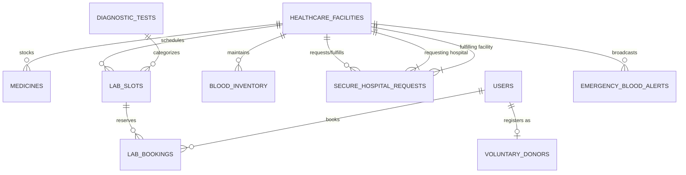

# PulsePoint Database Models & Data Privacy Architecture

This document defines the relational database architecture, entity relationships, role-based access control (RBAC), and strict HIPAA/GDPR-compliant data privacy partitioning for **PulsePoint**.

---

## 1. Entity Relationship Overview

---

## 2. Core Relational Entities & Data Dictionaries

### A. `healthcare_facilities`
Represents hospitals, central blood banks, accredited diagnostic labs, and registered pharmacies.
* `id` (VARCHAR-36, PK): Global UUID.
* `facility_type` (ENUM): `'HOSPITAL'`, `'BLOOD_BANK'`, `'PHARMACY'`, `'DIAGNOSTIC_LAB'`.
* `license_number` (VARCHAR): State medical/pharmacy regulatory registration.
* `is_cold_chain_certified` (BOOLEAN): Validates active monitored cold storage (2°C - 6°C).
* `latitude`, `longitude`: Geospatial location for distance and logistics routing.

### B. `medicines`
Pharmacy stock ledger with pricing, availability, and batch expiry tracking.
* `id` (VARCHAR-36, PK): Unique stock item.
* `facility_id` (FK -> healthcare_facilities): Physical dispensary.
* `name`, `generic_name`: Brand and active chemical molecule (e.g. Lipitor vs Atorvastatin).
* `dosage`, `dosage_form`: Strength and formulation (`Tablet`, `Syrup`, `Injection`, `Inhaler`).
* `price_cents`: Listed retail unit cost in cents.
* `stock_status`: `'IN_STOCK'`, `'LOW_STOCK'`, `'OUT_OF_STOCK'`.
* `quantity_in_stock`: Exact inventory count (accessible to pharmacy manager/admin; public sees categorical status).

### C. `diagnostic_tests` & `lab_slots` & `lab_bookings`
Complete appointment and slot capacity pipeline.
* `fasting_hours`: Patient preparation constraint (e.g., 10 hrs for CMP, 12 hrs for Lipid).
* `turnaround_hours`: Expected duration from collection to digital report delivery.
* `time_window`: Morning / Afternoon / Evening appointment chips.
* `booked_count` / `max_capacity`: Prevents overbooking via atomic slot locks.
* `booking_reference`: Public tracking token (e.g. `PP-LAB-891024`).

### D. `blood_inventory` (Private Facility View)
Cold-chain registry tracking physical units.
* `units_available`: Exact verified bag count.
* `storage_temp_celsius`: Real-time sensor readout (target 3.5°C - 4.5°C).
* `pathogen_screened`: Certification of negative results for HIV, Hep-B, Hep-C, and Syphilis.
* `cold_storage_unit_code`: Restricted physical rack code (e.g., `CRYOBANK-A / TANK-02`).

### E. `voluntary_donors`
Emergency voluntary blood donor registry.
* `masked_phone`: Redacted string (`98124*****`) for public privacy.
* `encrypted_phone`: Kept in secure vaults; decrypted only when authorized emergency alert dispatches occur.
* `last_donation_date`: Enforces clinical cooldown period (minimum 90 days between donations).
* `weight_kg`: Must be >= 50.0 kg for donor safety.

### F. `secure_hospital_requests` (Restricted Pipeline)
Inter-facility emergency blood requisition and cold-chain courier tracking.
* `requisition_id`: Institutional record code (`REQ-2026-STJUDE-9041`).
* `tracking_token`: Cryptographic logistics token generated per shipment (`PP-TX-...`).
* `priority`: `'ROUTINE'`, `'HIGH'`, `'CODE_RED_CRITICAL'`.
* `cold_chain_temp_celsius`: Monitored active temperature during courier transit.
* `status`: Stepper lifecycle (`PENDING_REVIEW` -> `STOCK_MATCHED` -> `COURIER_DISPATCHED` -> `IN_TRANSIT` -> `DELIVERED`).

---

## 3. Strict Role-Based Access Control (RBAC) Matrix

| Resource / Capability | Public / Patient | Voluntary Donor | Verified Hospital Admin | Pharmacy Manager |
| :--- | :---: | :---: | :---: | :---: |
| Search Medicines & Compare Chemist Prices | ✅ Read-only | ✅ Read-only | ✅ Full Read | ✅ Manage Own Stock |
| Reserve / Inquire Medicine | ✅ Allowed | ✅ Allowed | ✅ Allowed | ✅ Update Status |
| Browse Diagnostic Tests & Book Lab Slots | ✅ Full Booking | ✅ Full Booking | ✅ View Schedules | ❌ N/A |
| View Aggregated Blood Availability (Regional) | ✅ Aggregated Group Status | ✅ Aggregated Group Status | ✅ Exact Counts | ❌ N/A |
| View Sensitive Blood Bank Cold-Storage Racks | 🛑 REDACTED | 🛑 REDACTED | ✅ Full Access | 🛑 REDACTED |
| Register as Voluntary Emergency Donor | ❌ Must Register | ✅ Manage Profile | ✅ Emergency Directory | ❌ N/A |
| Respond to Urgent Blood Alerts ("I Can Donate") | ❌ Requires Donor Profile | ✅ Instant Dispatch Signal | ✅ Broadcast Alert | ❌ N/A |
| Raise Inter-Facility Blood Requisition | 🛑 FORBIDDEN | 🛑 FORBIDDEN | ✅ Authorized Key Required | 🛑 FORBIDDEN |
| Access Cold-Chain Logistics Cryptographic Tokens | 🛑 FORBIDDEN | 🛑 FORBIDDEN | ✅ Full Tracking & Stepper | 🛑 FORBIDDEN |
| Modify Exact Medicine / Blood Stock Quantities | 🛑 FORBIDDEN | 🛑 FORBIDDEN | ✅ Live Toggle & Stepper | ✅ Live Toggle & Stepper |

---

## 4. Privacy & HIPAA Compliance Architecture

1. **Public Anonymization**:
   - The Public Blood Hub exposes **only aggregated group health meters** (e.g. "O- : 6 Units Region-Wide - CRITICAL").
   - Physical storage tank coordinates (`CRYOBANK-A / TANK-02`) and pathogen screening officers are never serialized in public JSON responses.
2. **Donor PII Redaction**:
   - Donor phone numbers are masked on public APIs. Full contact details are accessible solely during active Level 1 trauma alerts by verified medical dispatch officers.
3. **Cryptographic Token Verification**:
   - Inter-facility blood transfers produce a non-guessable SHA token (`PP-TX-...`) verifying the cold-chain chain of custody between accredited healthcare facilities.
